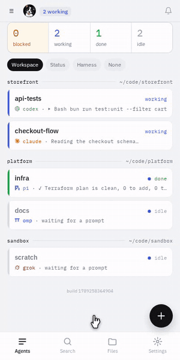
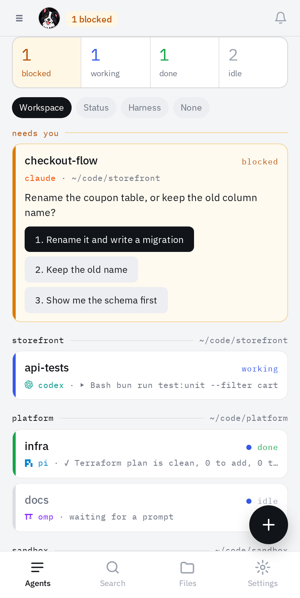
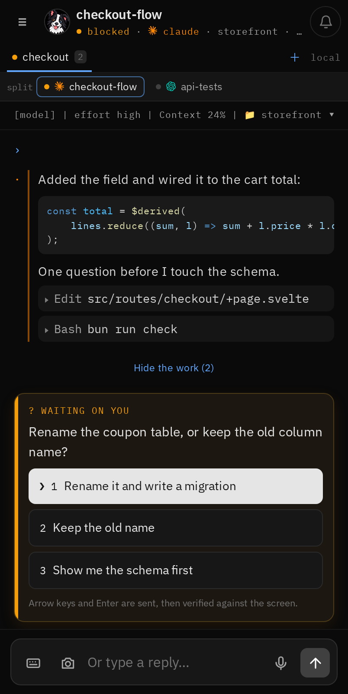
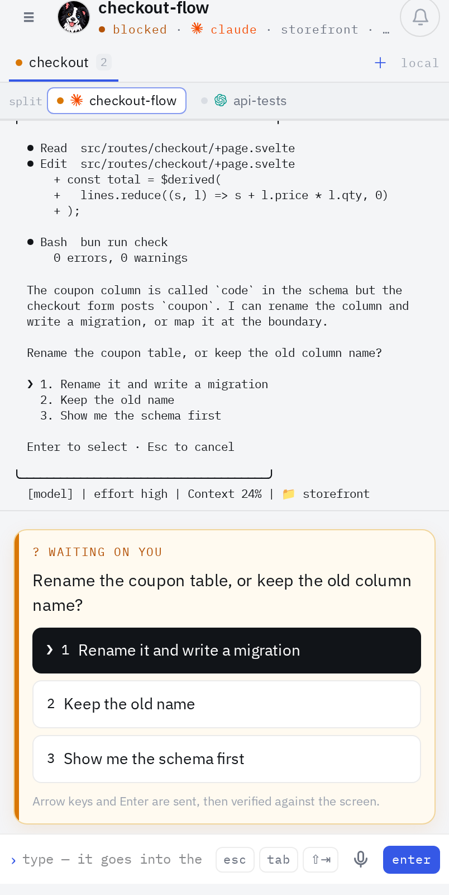
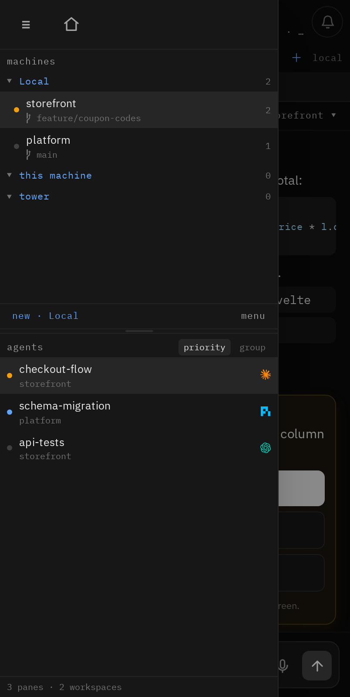
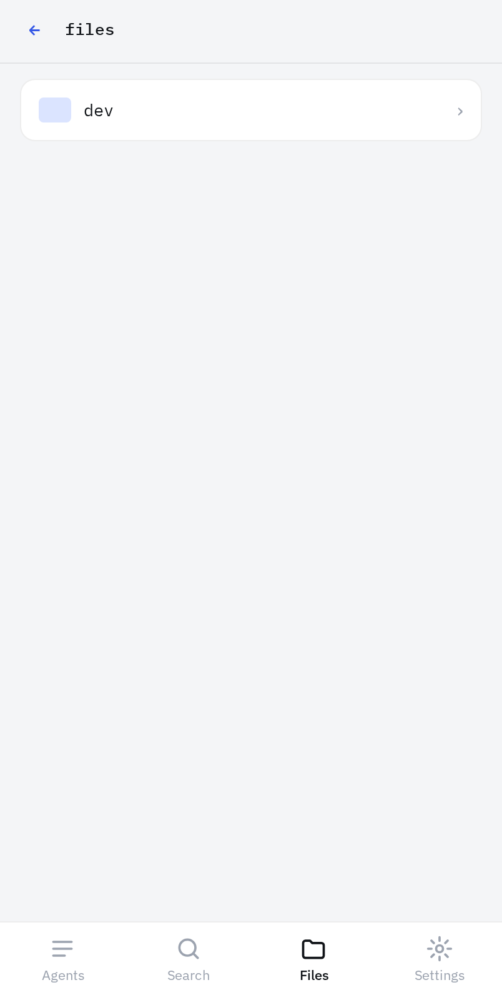
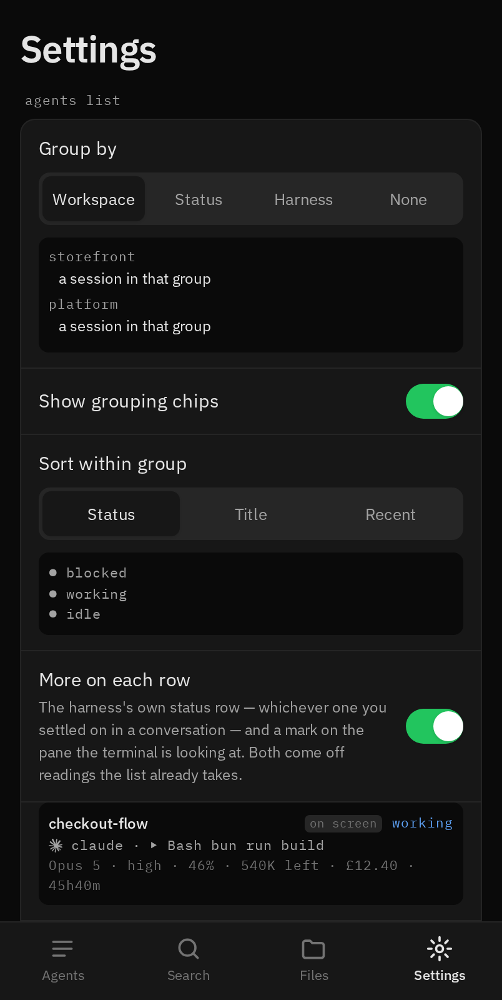

<p align="center"></p>

<h1 align="center">bordr</h1>

<p align="center">
  <strong>Your faithful, playful, roaming sheepdog - Herd(r) your flock from anywhere! <br>
    Read and drive every coding agent on your machine, from your phone.</strong>
  <br> A mobile web workspace for <a href="https://herdr.dev">herdr</a>, served over Tailscale.
  <br>Waggy Tail, Happy Dev :)
</p>

<p align="center">
  
</p>

<p align="center">
  <em>A blocked agent, answered from the list. No typing, no terminal.</em>
</p>

## Why I made this

I come from tmux and zellij, often accessing my PC via SSH apps on my phone. Tiny, cramped, but workable in a pinch. <br>
Then using Claude Code via the mobile app felt like a game-changer. Why couldn't all remote dev work be so easy? <br>
Then herdr came along and the way it manages agents and workspaces inspired me to try and get it working remotely.<br>
This is the result, I love it and use it every day. I hope you'll like it too!

## Who this is for

Anyone who runs multiple harnesses on their PC and wants to access them from anywhere. <br>
All you need is Tailscale, Herdr and a PC to run it on.

## What it does

### Answer without opening anything

- **A blocked agent, one tap.** Agents waiting on you are pinned to the top of
  the list with their first options inline, so you never have to open the
  conversation to unblock one.
- **Push the moment it blocks.** Tap the notification and it opens that
  conversation — or answer straight from the notification's own buttons.
- **Every harness in one list.** Claude Code, codex, pi, omp, grok, copilot and
  agy, each with its own mark, grouped by workspace, status or harness, and a
  line saying what it is actually doing.

### Read what happened

- **Sessions as chat, not terminal soup.** Each harness's own transcript,
  rendered prose first, with tool calls folded away behind a toggle.
- **Code that looks like code.** Syntax highlighting with VS Code's own
  grammars, and tool calls you can open to see the arguments, the diff and the
  result.
- **Search every session at once.** Quoted phrases, `-exclusions`, and filters
  for who said it and which harness.

### Drive it properly

- **Terminal mode.** The pane exactly as the machine draws it, with bordr's
  input box where the harness draws its own.
- **A tab's real split.** herdr splits a tab into panes; bordr shows that split
  rather than a row of chips, and you can drag the divider from the phone.
- **Drive a stubborn TUI.** A live screen peek plus an on-screen key strip
  (`esc tab ⇧⇥ ↑ ↓ ← → ␣ ⏎`) for anything the terminal insists on handling
  itself.
- **Slash command previews.** Type `/` and the harness's commands and your own
  skills, commands and plugins are listed with their descriptions. Print-style
  ones show their output inline; selector menus become tappable cards.
- **Type, dictate, or send a photo.** Attach photos or record long-form
  messages, or share a picture straight into bordr from another app.

### Your whole estate

- **herdr's own shape.** Machines, workspaces, tabs and panes, in a side panel
  that matches what herdr shows on the desktop.
- **Other machines, over SSH.** Name them in `BORDR_MACHINES` and bordr drives
  herdr on each of them too. Empty by default, because every machine you add is
  another one anyone reaching bordr can drive.
- **Browse and preview files.** Markdown, images, PDFs and text, with
  agent-built HTML reports rendering in the phone browser, sandboxed.

### Make it yours

- **Swipe between agents.** Left and right cycle through the list in whatever
  order you sorted it.
- **Back goes home.** One gesture from anywhere inside an agent returns to the
  list, rather than retracing every pane you looked at. Switchable.
- **Light and dark, and your own colours.** Chat bubbles instead of the default
  prefixed transcript, if you want them.
- **Loads more settings** to tweak the behaviour, check your connection, send a
  test notification and more — each with a live preview of what it does.

It installs to the home screen as a PWA and works on any modern phone browser.

## What it looks like

<table>
  <tr>
    <td width="33%" align="center">
      
      <br/><strong>The list</strong>
      <br/><sub>Blocked agents first, answerable in place.</sub>
    </td>
    <td width="33%" align="center">
      
      <br/><strong>A conversation</strong>
      <br/><sub>Prose first, code highlighted, tools folded away.</sub>
    </td>
    <td width="33%" align="center">
      
      <br/><strong>Terminal mode</strong>
      <br/><sub>The pane as the machine draws it.</sub>
    </td>
  </tr>
  <tr>
    <td width="33%" align="center">
      
      <br/><strong>The panel</strong>
      <br/><sub>Machines, workspaces, tabs and panes.</sub>
    </td>
    <td width="33%" align="center">
      
      <br/><strong>Files</strong>
      <br/><sub>Browse and preview, confined to roots you choose.</sub>
    </td>
    <td width="33%" align="center">
      
      <br/><strong>Settings</strong>
      <br/><sub>Every control shows what it does.</sub>
    </td>
  </tr>
</table>

<sub>Light and dark throughout; the shots above mix the two on purpose. Every image is captured against invented data by <code>scripts/screenshots.ts</code>.</sub>

## How it works

```
herdr (this host) ──unix socket──┐
                                 ├─> bordr (SvelteKit on Bun) ──HTTPS/SSE──> your phone
herdr (named machines) ──ssh -L──┘
```

- **Read.** Each harness's own session transcript, straight off disk: Claude
  Code, codex, pi, omp, agy (Antigravity), grok and copilot today. Harnesses
  without an adapter fall back to a cleaned terminal snapshot.
- **Write.** Always through herdr's socket API: `agent.prompt` for text,
  `agent.send_keys` for pickers and the key strip, `pane.send_text` for typing
  in terminal mode.
- **Reach.** Other machines only when `BORDR_MACHINES` names them, over an SSH
  forward to that machine's own herdr socket. Empty by default.
- **Live.** One herdr event stream, fanned out to phones over SSE.
- **Push.** A boot-time watcher fires a Web Push the moment any agent turns
  `blocked`.

## Before you start

**bordr has no login.** It drives coding agents that can run any command on the
machine it is installed on, and on any machine you name in `BORDR_MACHINES`,
and it can read files under the directories you point it at. Whoever can reach its port can do both of those things. That is
deliberate, a tailnet is the boundary, but it means bordr must never be
exposed to a network you do not control. It refuses to serve on a public
address unless you explicitly override it. Read [SECURITY.md](SECURITY.md)
before installing; it is short. If I had to say one thing: Serve it with `tailscale serve`, never `tailscale funnel`. Serve keeps the
address inside your tailnet; funnel publishes it to the whole internet, and
because funnel proxies to loopback it walks straight past bordr's own bind
guard. If you share your tailnet with anyone, restrict who can reach bordr's
host and port with [Tailscale grants](https://tailscale.com/docs/features/access-control/grants),
and set `BORDR_ALLOWED_USERS` so bordr checks the caller's tailnet identity
itself.

## Prerequisites

| Thing                              | Why                                 | Notes                                                         |
| ---------------------------------- | ----------------------------------- | ------------------------------------------------------------- |
| [Bun](https://bun.sh) 1.2+         | runtime + package manager           | install per the Bun docs                                      |
| [herdr](https://herdr.dev)         | the terminal workspace bordr drives | must be running; protocol 19 or newer, tested on 20           |
| At least one coding agent          | the point of it all                 | Claude Code, codex, pi, omp, grok… running inside herdr panes |
| herdr's integration per harness    | how bordr finds each transcript     | `herdr integration install claude` (and codex, pi, omp…)      |
| [Tailscale](https://tailscale.com) | the security boundary + HTTPS       | optional for a loopback-only trial, required to use a phone   |
| Linux or macOS host                | herdr's socket API                  | the phone is any modern browser                               |

## Quickstart

### If you have a coding agent

Point it at this repository and give it this:

> Install bordr from this repository. Read `README.md` and `SECURITY.md` first.
> Install dependencies with Bun, create `.env` from `.env.example`, set
> `HERDR_SOCKET` to my herdr session socket, keep `HOST` on `127.0.0.1`, build
> it, and run the smoke test. Then tell me the exact `tailscale serve` command
> for my machine and what to open on my phone. Do not bind to `0.0.0.0`.

Then read what it did before trusting it. Everything below is the same work by
hand, in order.

### By hand

**1. Get it and install.**

```bash
git clone https://github.com/AnnasCookies/bordr.git
cd bordr
bun install
```

**2. Find your herdr socket.** herdr keeps one per session:

```bash
ls ~/.config/herdr/sessions/*/herdr.sock
```

If that prints nothing, herdr is not running. Start a session
(`herdr --session main`) and look again.

While you are there, install herdr's integration for each harness you use.
It is how herdr learns which session file an agent is writing, and without it
bordr can only show the terminal:

```bash
herdr integration install claude   # and codex, pi, omp, grok, ...
herdr integration status
```

**3. Configure.**

```bash
cp .env.example .env
```

Then edit `.env`:

- `HERDR_SOCKET`, the path from step 2.
- `HOST`, leave it as `127.0.0.1`. See the warning above. bordr answers `503`
  to everything with it unset, because the adapter's own default is every
  interface.
- `PORT`, anything free; `7682` by default.
- `BORDR_FILE_ROOTS`, optional `name:path` pairs the file browser may serve,
  comma separated, default `dev:~/Documents/Dev`. Point it only at directories
  you would be content to read over the network. Dotfiles are refused outright,
  so `.env` and `.ssh` are never served even inside a configured root.

**4. Build and run.**

```bash
bun run build
bun ./build/index.js
```

Open `http://127.0.0.1:7682` on the same machine. You should see your agents.

**5. Reach it from a phone.** A phone needs HTTPS, both for notifications and
to install the app to the home screen. On a tailnet:

```bash
sudo tailscale serve --bg --https=8444 http://127.0.0.1:7682
tailscale serve status
```

That prints the URL. Open it on your phone and add it to the home screen.

**6. Notifications (optional).** Web Push needs its own keys:

```bash
bunx web-push generate-vapid-keys
```

Put them in `.env` as `VAPID_PUBLIC_KEY`, `VAPID_PRIVATE_KEY` and
`VAPID_SUBJECT` (any URL you control, or a `mailto:`). Restart, then tap the
bell in the app. Without these keys everything else works and the push endpoint
returns 503.

`BODY_SIZE_LIMIT` and `IDLE_TIMEOUT` in `.env` raise two adapter defaults that
are too small for phones (a 512KB request cap refuses every camera photo). Bun
reads `.env` when you run the build by hand, and the unit below sets the same.

### Keep it running

```bash
mkdir -p ~/.config/systemd/user
cp deploy/herdr-session.service deploy/bordr.service ~/.config/systemd/user/
# edit WorkingDirectory, EnvironmentFile and ExecStart (`which bun`, `which herdr`)
systemctl --user daemon-reload
systemctl --user enable --now herdr-session bordr
loginctl enable-linger "$USER"   # so it survives logout and starts at boot
```

`herdr-session.service` runs `herdr --session main server` headlessly so the
session exists at boot. This matters more than it looks: if you reach herdr
through a browser terminal such as ttyd, that spawns `herdr --session main`
**per connection**, so after a reboot no herdr server exists until a human
opens the terminal, and bordr comes up pointing at nothing.

On macOS there is no systemd; a `launchd` agent or a herdr pane that runs
`bun ./build/index.js` does the same job.

To deploy a change, `bun run deploy` builds, restarts the service and smoke
tests it. A phone that has the app open keeps running the old code until it
reloads, so the app checks for a new build every 30 seconds (and whenever it
comes back to the foreground) and offers a "tap to reload" pill.

### If something is wrong

| Symptom                                    | Cause                                                                                   |
| ------------------------------------------ | --------------------------------------------------------------------------------------- |
| `503` and a message about authentication   | `HOST` is unset, or not loopback or a tailnet address; the guard is doing its job       |
| `421` and a message about the hostname     | you reached bordr by a name it does not serve; `BORDR_ALLOWED_HOSTS` if it is yours     |
| "herdr is not running"                     | `HERDR_SOCKET` points at nothing; re-run step 2                                         |
| "herdr version not supported"              | herdr older than protocol 19                                                            |
| No agents listed and no error              | herdr is running but has no agent panes                                                 |
| Notifications do nothing                   | no VAPID keys, not HTTPS, or on an iPhone not installed to the home screen              |
| Conversation shows terminal text, not chat | the label says why: no adapter for that harness, or `herdr integration install` not run |

## Using it

- **Agents.** Every pane as a status-rail row with a one-line preview of what
  it is doing, a rollup grid, and grouping by workspace, status or harness
  (Settings). Agents waiting on you are pinned in a "needs you" section with
  their first options inline, answer without opening the conversation. ＋
  starts a new session in a bottom sheet.
- **Conversation.** Prefixed transcript (`›` you, `·` the agent); swipe right
  for the next agent down the list, left for the previous. The harness's own status line
  (model / context / quota) pinned in the header, tap to expand. Amber card =
  the agent is waiting: tap an option to answer. 📷 attaches a photo or
  screenshot (the agent reads the file). ⌨ opens a live screen peek with
  Esc/arrows/Tab/Enter for anything the TUI insists on doing itself.
- **Slash commands.** Type `/` and a list appears: the harness's own commands
  plus your skills, commands and plugins, read off disk the way the harness
  reads them, with their descriptions. Print-style ones show their output
  inline; panel-style ones (`/usage`, `/config`) render in the ⌨ peek and the
  page says a menu is open; selector menus (`/model`, `/effort`) become
  tappable cards.
- **Terminal mode.** The pane as the machine draws it, with bordr's input box
  where the harness draws its own and the key strip beside it. Chosen per pane
  in Settings, or automatically for a plain shell.
- **The panel.** ☰ opens machines, workspaces, tabs and panes — herdr's own
  shape. Drag the divider to give the machines or the agents more room. The
  same ☰ closes it, and 🏠 goes back to the list.
- **Split panes.** Where herdr has split a tab, bordr shows that split rather
  than a row of chips. The pane you are in holds the transcript and composer;
  the others show their own screens, and a tap moves you there.
- **Search.** 🔍 searches every live session's transcript. Multiple words must
  all appear, `"quoted"` matches a phrase, `-word` excludes. Chips narrow to
  your own messages or the agent's, and to one harness. Results are capped per
  session so one chatty pane cannot crowd out the rest, and say so when capped.
- **Files.** `/f` browses your configured roots with Download and Share on
  every row and a long-press actions sheet; tap a file to view it (Markdown
  rendered, images with paging, PDF, text with line numbers). Agent-built HTML
  renders in the phone browser, sandboxed. Bytes are served from `/raw/…`.

- **Settings.** Grouping, sort, rollup, preview line, theme (light/dark/system),
  mono size, key strip, Enter behaviour, dictation language, push, and a
  Connection screen showing what bordr is talking to.

## Security model

The tailnet is the entire boundary, treat bordr like an open terminal on
every machine that can reach it, and on every machine it can reach. Other
machines are opt-in: bordr drives only the ones `BORDR_MACHINES` names, and
none by default. There is no login. Served artifacts render in
a sandboxed opaque origin and cannot call bordr's APIs; the file browser is
traversal- and symlink-proofed to its configured roots and refuses dotfiles at
the resolver, so `.env` cannot be listed or fetched; the keypad endpoint
accepts only inert navigation keys; uploads are size-capped and their
declared MIME type is allow-listed.
If you ever expose bordr beyond your tailnet, add real authentication first.

## Development

```bash
bun run dev          # against your live herdr
bun run test:unit    # protocol, client, parsers, adapters (vitest)
bun run test:e2e     # phone-viewport Playwright against the adapter output; some tests need a live herdr with agents
bun run lint && bun run check
bun run deploy       # build + restart + smoke-test the deployed page
bun run smoke <url>  # load the deployed page in a real browser and assert it works
bun run scripts/probe-harness.ts <kind>   # drive one harness through the whole phone flow and report
```

`test:e2e` and `smoke` drive a real Chromium; the first run downloads it
(`bunx playwright install chromium`).

`smoke` exists because every server-side check can pass while the app is broken:
a build that left stale asset hashes in the HTML served 200 for the document,
the API and the SSE stream while every JS bundle 500'd, so the page never
hydrated. Always finish a deploy with it.

## Licence

MIT. See [LICENSE](LICENSE).
